<div align="center">

# 📓 Tradepad

### A beautiful, self-hosted trading journal with built-in MCP.

**Log trades. See your edge. Let Claude fill it in for you.**

[](https://nextjs.org/)
[](https://www.typescriptlang.org/)
[](https://www.sqlite.org/)
[](https://www.docker.com/)
[](https://modelcontextprotocol.io/)
[](https://opensource.org/licenses/MIT)

</div>

---

Every trader says they "keep a journal." Most open a spreadsheet for a week and give up. Tradepad is built for the rest of us: it's so nice to look at that you'll *want* to open it, it remembers your rules, and it lets Claude Code log your trades for you while you focus on the market.

## ✨ Why Tradepad

- 🗓️ **GitHub-style P/L calendar** — see every winning and losing day at a glance.
- 📈 **Equity curve + drawdown** — your account's story in two charts.
- 💀 **Mistakes cloud** — repeat offenders in big red bars. Pay the lesson once.
- 🤖 **MCP built-in** — Claude Code logs trades, days, mistakes for you from any session.
- 🔒 **Yours, forever** — SQLite file in your folder, images in your folder, backups in your folder. No cloud. No login. No account.
- 🎨 **Actually beautiful** — glassmorphism, Inter, gradient mesh, dark-mode first.

## 📸 Gallery

### Home — heatmap, equity curve, recent days
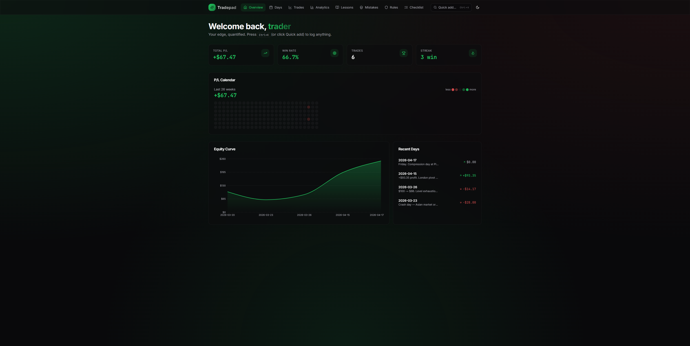

### Analytics — the numbers that matter
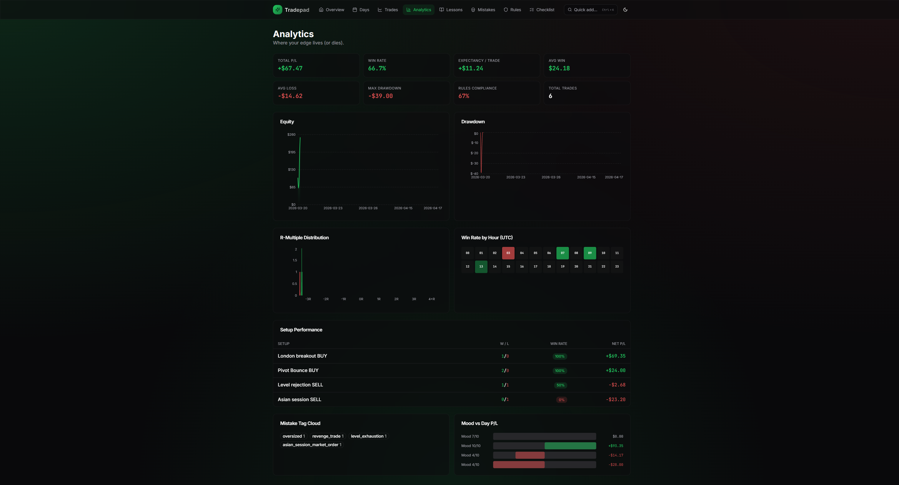

### Daily journal list — at-a-glance history
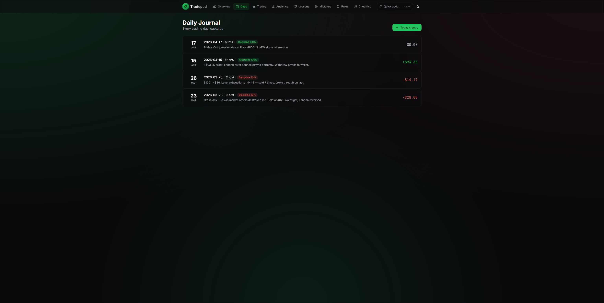

### Day editor — notes, checklist, trades, screenshots
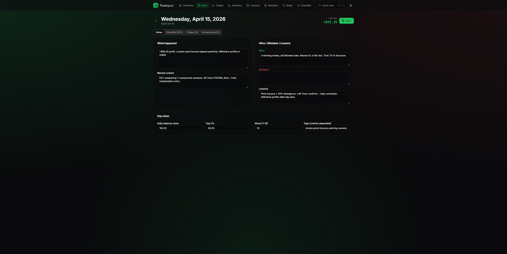

### Trades — sortable table with R-multiple and setup type
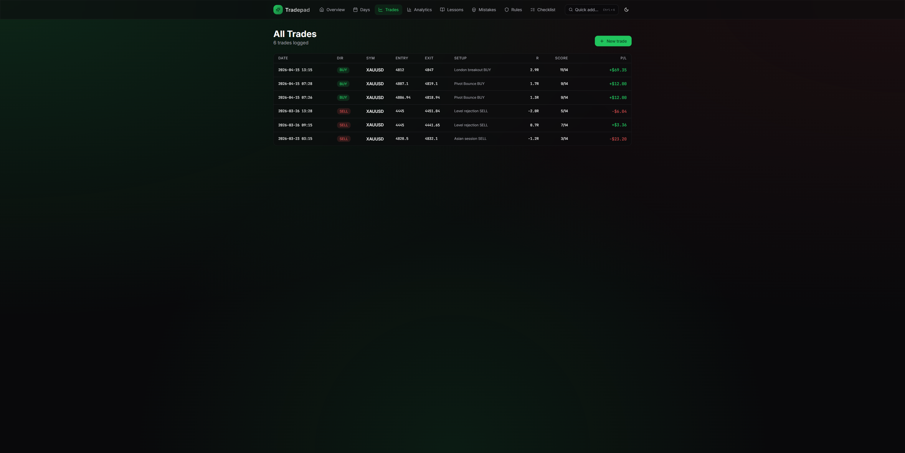

### Trade editor — entry + review + screenshot drag-drop
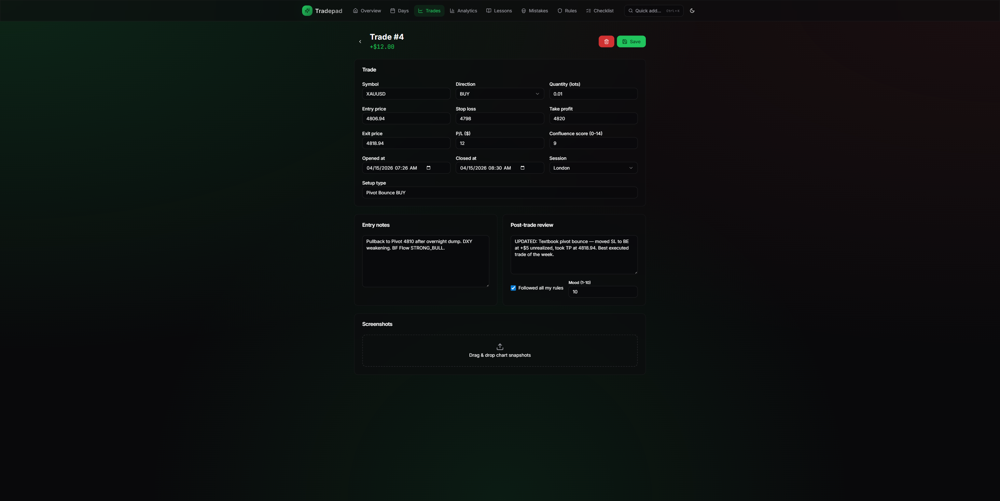

### Observations — spot patterns by hour, weekday, category
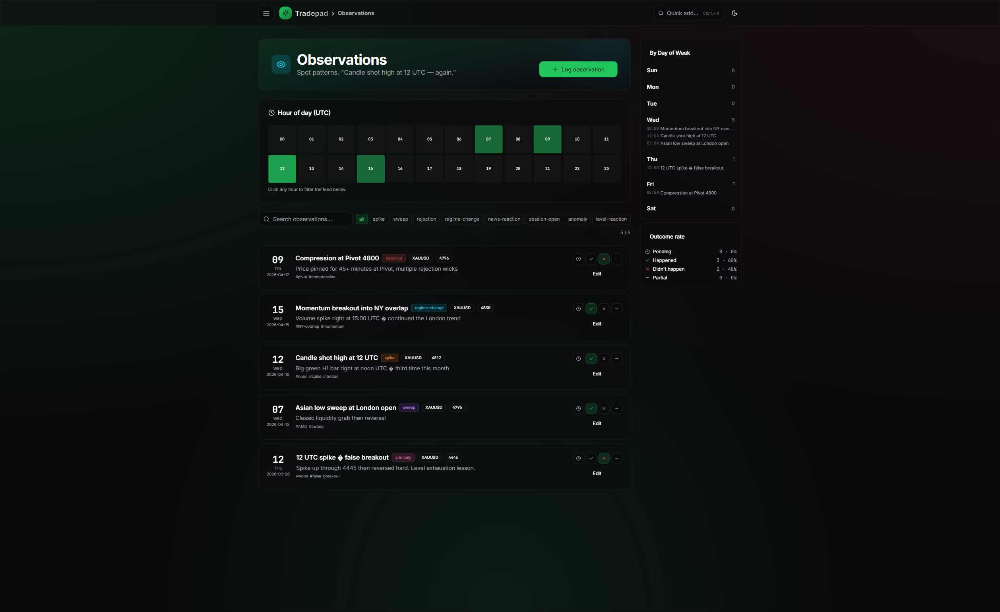

### Drawer menu — slides in from the left with gradient icon tiles
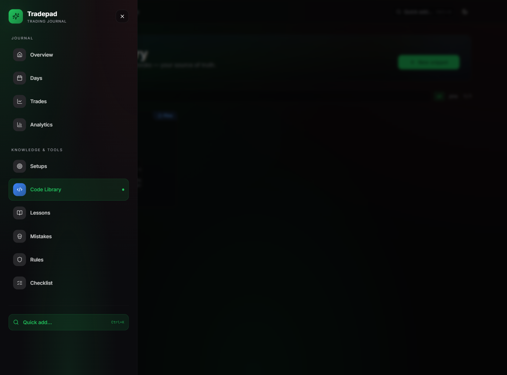

### Setups — your playbook, card-based, click to edit
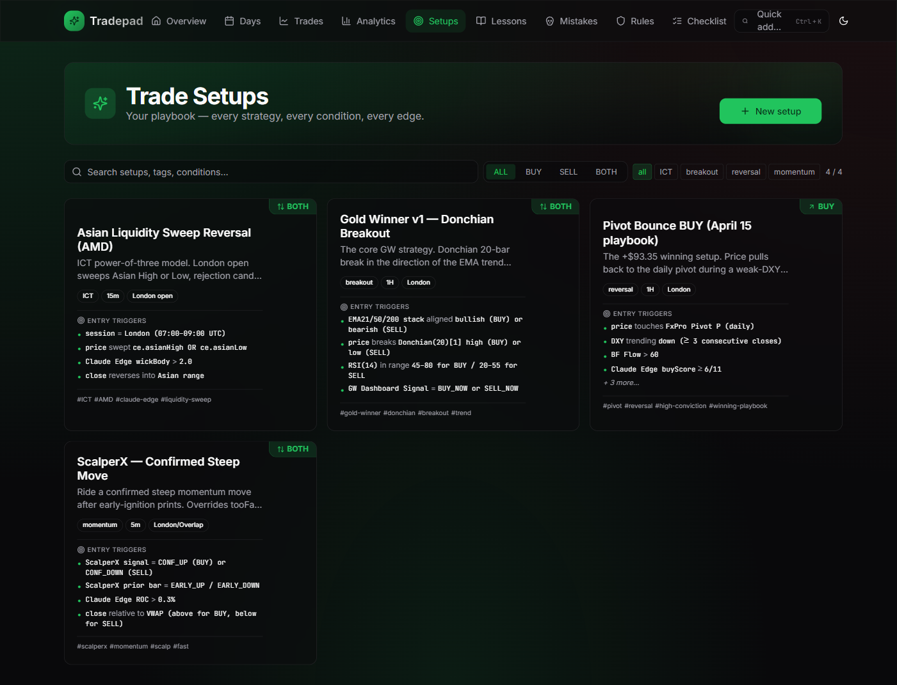

### Code Library — Pine, MQL4/5, Python, webhooks, anything
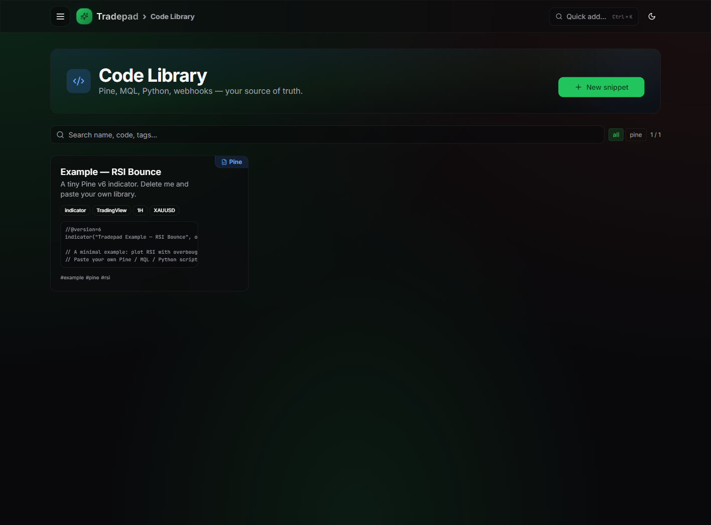

### Mistakes — "Mistakes were made." Pattern cloud + repeat offenders
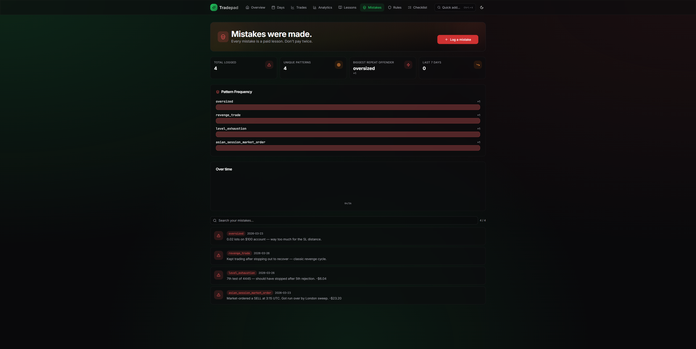

### Lessons — searchable, tagged, severity-coded knowledge base
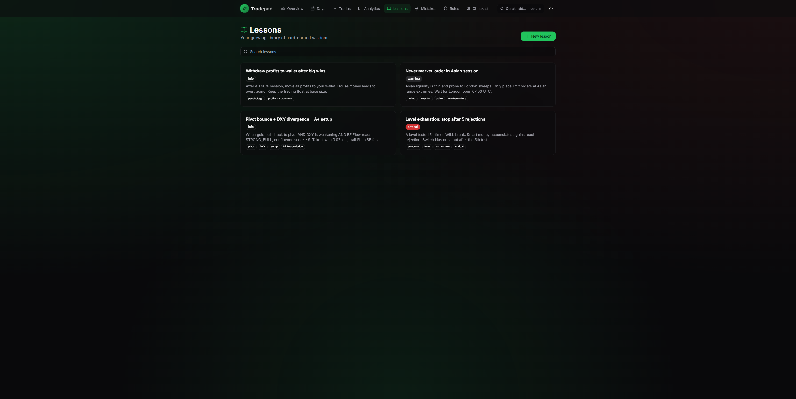

### Rules — living rulebook organised by category
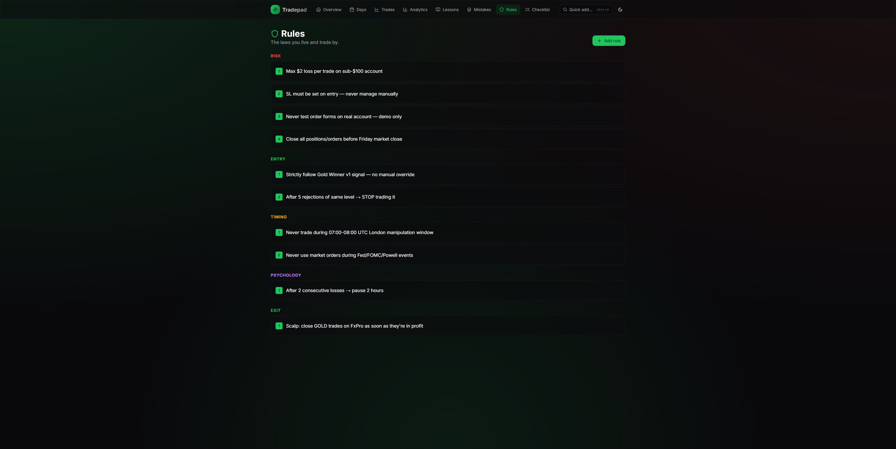

### Checklist — pre-trade discipline scored automatically
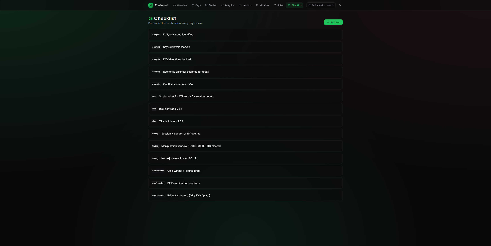

## 🚀 Quick start

```bash
git clone https://github.com/ehabhussein/TradePad.git
cd TradePad
cp .env.example .env       # edit API_KEY for production
docker compose up -d --build
```

Open **http://localhost:3330** → you're in.

Data lives in `./data/` — SQLite DB, screenshots, and backups all mount as a bind volume. Blow away the container any time, the data stays.

## 🎯 Features

### Core journaling
- 📅 Daily entries — what happened, market context, mood (1–10), wins, mistakes, lessons
- 💸 Trade log — entry/exit/SL/TP, auto R-multiple, setup type, session, 0–14 confluence score
- 📸 Drag-drop screenshots attached to a day OR a trade
- 📋 Pre-market checklist with auto-scored discipline %

### Analytics (all charts update live)
- GitHub-style **P/L heatmap calendar** (26 weeks)
- **Equity curve** + drawdown shading
- **R-multiple histogram** — are your winners 2R+?
- **Session heatmap** — win rate by UTC hour
- **Setup performance** table sorted by edge
- **Mood vs P/L** scatter — does trading angry lose money? *(yes)*
- **Drawdown chart**

### Knowledge base
- 👁 **Observations** — market-behavior diary. Log "candle shot high at 12 UTC" with category, outcome (happened / didn't / partial), hour/weekday auto-extracted. Hour-of-day heatmap + weekday dock surface repeating patterns.
- 🎯 **Trade Setups** — reusable strategy templates with structured entry/exit conditions, SL/TP rules, invalidation, confluences. Card-based UI, click any to edit.
- 💻 **Code Library** — Pine Script, MQL4, MQL5, Python, JavaScript, webhook JSON. Paste your whole trading toolbox. Copy-to-clipboard on every snippet.
- 📚 **Lessons library** — searchable, tagged, severity-coded
- 💀 **Mistakes page** — tag cloud, frequency bars, monthly trend, repeat-offender tracker
- 📜 **Rules book** organised by category (risk / entry / exit / timing / psychology)
- 🎯 **Goals tracker** — account size, R-target, deadlines
- 📷 Screenshot gallery per day/trade

### Delight
- 🌓 Dark mode first
- ⌨️ **Ctrl+K command palette** (works on Windows/Linux/Mac)
- 🔘 Visible "Quick add…" button for the keyboard-shy
- 🎨 Glassmorphism, gradient mesh background, subtle animations
- 📱 Mobile-responsive

## 🔌 MCP — Let Claude log for you

Tradepad ships an MCP server at `http://localhost:3330/api/mcp/sse` (SSE transport, same Docker container, no extra process).

### Connect Claude Code

Add to `~/.claude/settings.json`:

```json
{
  "mcpServers": {
    "tradepad": {
      "url": "http://localhost:3330/api/mcp/sse"
    }
  }
}
```

Restart Claude Code → tools appear as `mcp__tradepad__*`.

### Available tools

| Tool | What Claude can do |
|------|-------------------|
| `add_trade` | Log a trade, auto-calculates R-multiple |
| `update_trade` | Patch an existing trade (add exit price after close) |
| `list_trades` / `get_trade` | Retrieve trades |
| `upsert_day` | Create or update a daily journal entry |
| `get_day` / `list_days` | Read day entries |
| `add_setup` / `update_setup` / `list_setups` / `get_setup` / `delete_setup` | Full CRUD on trade setups |
| `add_code` / `update_code` / `list_code` / `get_code` / `delete_code` | Full CRUD on the code library (Pine, MQL, Python, JSON…) |
| `add_observation` / `update_observation` / `list_observations` / `get_observation` / `delete_observation` | Log what you noticed and whether it happened. Filters by hour, weekday, category. |
| `add_lesson` / `search_lessons` | Grow the knowledge base |
| `log_mistake` / `list_mistakes` | Track categorized mistakes |
| `add_rule` / `list_rules` | Manage the rulebook |
| `add_checklist_item` / `list_checklist` | Pre-trade checklist |
| `add_snapshot` | End-of-day balance for the equity curve |
| `add_goal` | Log trading goals |
| `list_screenshots` | See what's attached where |
| `stats` | Full analytics JSON |
| `journal_summary` | Human-readable one-screen summary |

### What it feels like

> **You:** _"Log that winning BUY — opened at 4806.94, closed at 4818.94, setup was pivot bounce, $12 profit, London session."_
>
> **Claude:** *(calls `mcp__tradepad__add_trade`, shows the new row)*
> _"Added trade #47. That's your 3rd pivot-bounce winner in London this week — +$41 total from that setup."_

## 🧱 Stack

- **Next.js 15** (App Router, standalone output)
- **React 19** + **TypeScript**
- **Tailwind v3** + **shadcn/ui** + **Framer Motion**
- **Drizzle ORM** + **better-sqlite3** (WAL mode, foreign keys on, migrations on boot)
- **Recharts** for charts
- **@modelcontextprotocol/sdk** for the MCP server (SSE transport)
- **Docker multi-stage** → ~150MB final image

## 🌐 REST API

The browser speaks to these same endpoints. Same-origin requests bypass the API-key gate automatically; external callers pass `X-API-Key: <key>` header or `?key=<key>` query.

| Method | Route |
|--------|-------|
| GET/POST/DELETE | `/api/entries` |
| GET/POST/PATCH/DELETE | `/api/trades` |
| GET/POST/DELETE | `/api/screenshots` |
| GET | `/api/screenshots/[filename]` |
| GET/POST/PATCH/DELETE | `/api/lessons` |
| GET/POST/PATCH/DELETE | `/api/rules` |
| GET/POST/PATCH/DELETE | `/api/checklist` |
| GET/POST/DELETE | `/api/mistakes` |
| GET/POST/DELETE | `/api/snapshots` |
| GET/POST/PATCH/DELETE | `/api/goals` |
| GET | `/api/stats` |
| GET | `/api/mcp/sse` — MCP SSE |
| POST | `/api/mcp/messages?sessionId=X` — MCP JSON-RPC |

### Example — curl a trade

```bash
curl -X POST http://localhost:3330/api/trades \
  -H "Content-Type: application/json" \
  -H "X-API-Key: $API_KEY" \
  -d '{
    "symbol":"XAUUSD","direction":"BUY",
    "entryPrice":4806.94,"exitPrice":4818.94,
    "quantity":0.01,"pnl":5.84,
    "setupType":"Pivot Bounce BUY","session":"London",
    "openedAt":"2026-04-15T07:26:00Z",
    "closedAt":"2026-04-15T08:30:00Z"
  }'
```

## 🗂️ Project layout

```
Tradepad/
├── Dockerfile                     # Multi-stage build
├── docker-compose.yml             # One command to rule them all
├── src/
│   ├── app/
│   │   ├── page.tsx               # Home — heatmap + stats + equity
│   │   ├── days/                  # Daily journal
│   │   ├── trades/                # Trade CRUD
│   │   ├── analytics/             # All the charts
│   │   ├── lessons/               # Knowledge base
│   │   ├── mistakes/              # "Mistakes were made" page
│   │   ├── rules/                 # Rulebook
│   │   ├── checklist/             # Pre-trade checklist admin
│   │   └── api/
│   │       ├── entries/, trades/, screenshots/, lessons/, rules/,
│   │       │   checklist/, mistakes/, snapshots/, goals/, stats/
│   │       └── mcp/
│   │           ├── sse/           # SSE endpoint (GET)
│   │           └── messages/      # JSON-RPC inbox (POST)
│   ├── components/                # shadcn/ui + custom (nav, charts, editors)
│   └── lib/
│       ├── db/                    # Drizzle schema + auto-migrate + seed
│       ├── mcp/tools.ts           # MCP tool definitions + handlers
│       └── utils.ts
├── drizzle/                       # SQL migrations
└── data/
    ├── journal.db                 # SQLite
    ├── screenshots/
    └── backups/
```

## 🗄️ Backup

```bash
docker compose exec tradepad npm run backup
# → drops a timestamped copy into ./data/backups/
```

Or just copy `./data/journal.db` anywhere. It's a single file.

## 🛠️ Development

```bash
npm install --legacy-peer-deps
npm run dev           # http://localhost:3330
npm run db:generate   # regenerate Drizzle migrations after schema edits
```

## 🪪 License

MIT — do whatever, just don't blame the journal for your red days.

---

<div align="center">

**Built by a trader, for traders.** No SaaS. No subscription. No ads.

Your journal, your machine, your edge.

</div>
